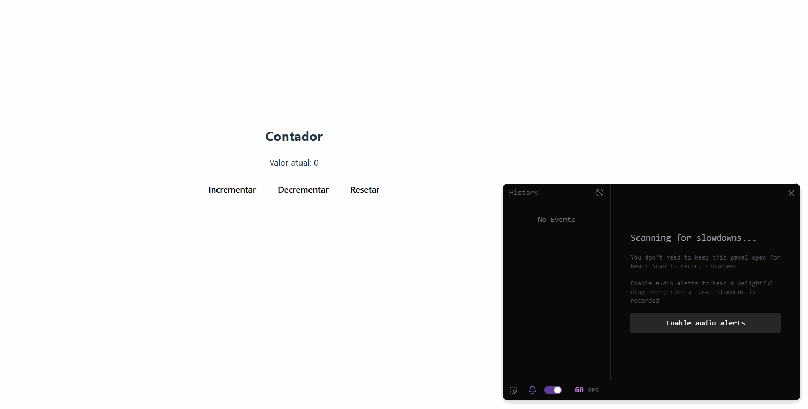

## React archtecture

https://medium.com/@ruchivora16/react-how-react-works-under-the-hood-9b621ee69fb5

### Processo

Render Phase:
React recria uma nova árvore de elementos (Virtual DOM) com base no novo estado/props.

Diffing:
React compara a nova árvore com a anterior:
- Se o tipo do elemento mudou → recria o nó inteiro.
- Se o tipo é o mesmo → compara props e filhos.
- Se só mudaram props → marca como “update”.

Commit Phase:
React aplica as mudanças necessárias no DOM real (adicionar, remover, atualizar nós).

Aqui é onde o useEffect roda.

Fiber Reconciliation:
Antes do React 16, o diffing era síncrono — travava a UI em grandes atualizações.
Com o React Fiber, o React passou a:

- Dividir o trabalho em pequenas partes (chamadas fibers).
- Pausar e retomar o processo de renderização.
- Dar prioridade a atualizações mais importantes (ex: animações, input do usuário).

Ou seja: o React Fiber é uma nova arquitetura interna que permite renderização assíncrona e incremental.

Cada fiber é um objeto que representa:

- um componente,
- seu estado,
- seus filhos e pais na árvore,
- e o tipo de atualização necessária.